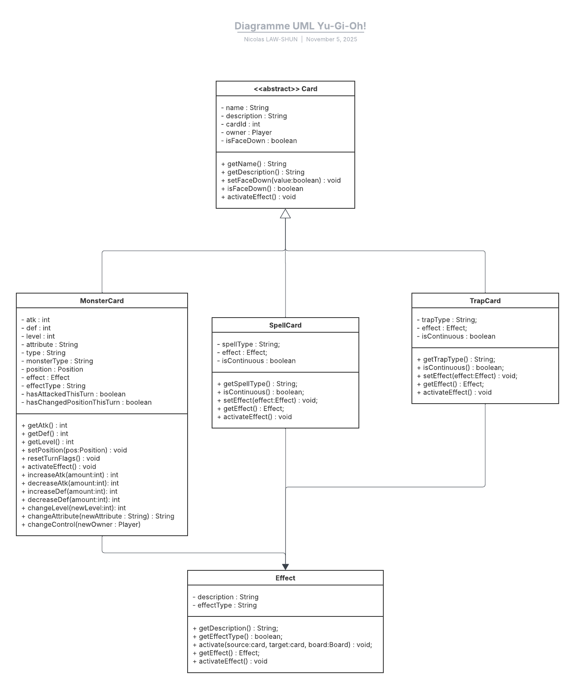

# Documentation Technique – Moteur de Jeu Yu-Gi-Oh!

Ce document présente l’architecture technique d’un moteur de jeu inspiré du célèbre jeu de cartes Yu-Gi-Oh!.  
Il décrit les principales classes, leurs responsabilités, leurs interactions, ainsi que les structures de données utilisées pour modéliser les mécaniques du jeu.

L’objectif est de fournir une base claire et extensible pour le développement d’un simulateur de duel, en respectant les règles fondamentales du jeu tout en permettant des évolutions futures.

## Architecture Objet

Le système repose sur une architecture orientée objet, structurée autour des entités suivantes :

- **Game** : Gère le déroulement de la partie (joueurs, phases, tours, conditions de victoire).
- **Player** : Représente un joueur avec ses points de vie, sa main, son terrain et ses ressources.
- **Board** : Modélise le terrain du joueur, avec les zones de monstres, magie/piège, terrain, cimetière, bannies, etc.
- **Deck / ExtraDeck / Graveyard / BanishedZone / Hand** : Représentent les différentes zones de cartes du joueur.
- **Card** : Classe abstraite représentant une carte générique, avec ses sous-classes `MonsterCard`, `SpellCard`, `TrapCard`.

Chaque classe est conçue pour encapsuler ses responsabilités et interagir avec les autres via des méthodes bien définies.

## Diagramme UML

Le diagramme ci-dessous illustre les relations entre les principales classes du moteur :

- Composition entre `Game` et `Player`, `Player` et ses zones (`Board`, `Deck`, etc.)
- Agrégation entre `Board` et les cartes posées (`MonsterCard`, `SpellCard`)
- Héritage entre `Card` et ses sous-classes (`MonsterCard`, `SpellCard`, `TrapCard`)

## Diagramme UML du moteur de jeu

Ce diagramme représente l’architecture objet du moteur de jeu Yu-Gi-Oh!.


## 🎮 Classe `Game`

### 📌 Responsabilité
La classe `Game` est le cœur du moteur de jeu.  
Elle orchestre le déroulement d’une partie Yu‑Gi‑Oh! en gérant les joueurs, les phases, les tours, et les conditions de victoire.

---

### 🧩 Attributs

| Nom               | Type     | Description |
|------------------|----------|-------------|
| `player1`         | Player   | Premier joueur de la partie |
| `player2`         | Player   | Deuxième joueur |
| `currentPlayer`   | Player   | Joueur actif pendant le tour |
| `currentPhase`    | Phase    | Phase actuelle du tour (Main, Battle, End...) |
| `turnCount`       | int      | Numéro du tour en cours |
| `isGameOver`      | boolean  | Indique si la partie est terminée |

---

### 🛠️ Méthodes

| Signature | Description |
|----------|-------------|
| `startGame()` | Initialise la partie et les joueurs |
| `nextPhase()` | Passe à la phase suivante du tour |
| `endTurn()` | Termine le tour du joueur actif |
| `getOpponent()` | Retourne l’adversaire du joueur actif |
| `getCurrentPlayer()` | Retourne le joueur actif |
| `checkWinCondition()` | Vérifie si une condition de victoire est remplie |
| `switchPlayer()` | Change le joueur actif |
| `incrementTurn()` | Incrémente le compteur de tours |
| `resetPhase()` | Réinitialise la phase à la première du tour |
| `endGame(winner:Player)` | Termine la partie et désigne le gagnant |
| `isOver()` | Retourne l’état de fin de partie |

---

### 🔗 Relations

- **Composition** avec `Player` : `Game` contient deux instances de `Player`.
- **Interaction** avec `Phase` : chaque tour est découpé en phases (Main, Battle, End...).
- **Coordination** avec les méthodes des joueurs (`drawCard`, `summonMonster`, etc.).

---

### 💡 Exemple d’usage

```java
Game duel = new Game(playerA, playerB);
duel.startGame();

while (!duel.isOver()) {
    duel.getCurrentPlayer().drawCard();
    duel.nextPhase();
    // ...
    duel.endTurn();
    duel.switchPlayer();
    duel.incrementTurn();
}
```

## 🧑‍🤝‍🧑 Classe `Player`

### 📌 Responsabilité
La classe `Player` représente un joueur dans la partie.  
Elle gère son identité, ses points de vie, ses zones de jeu (Deck, ExtraDeck, Hand, Board), et les actions qu’il peut effectuer pendant les différentes phases du tour.

---

### 🧩 Attributs

| Nom                     | Type       | Description |
|-------------------------|------------|-------------|
| `name`                  | String     | Nom du joueur |
| `lifePoints`            | int        | Points de vie du joueur |
| `deck`                  | Deck       | Pioche principale |
| `extraDeck`             | ExtraDeck  | Deck spécial (Fusion, Synchro, XYZ, Lien) |
| `hand`                  | Hand       | Main du joueur |
| `board`                 | Board      | Terrain du joueur |
| `hasPlayerNormalSummon` | boolean    | Indique si le joueur a déjà effectué son Invocation Normale ce tour |

---

### 🛠️ Méthodes

| Signature | Description |
|-----------|-------------|
| `drawCard()` | Pioche une carte depuis le Deck |
| `resolveStandbyEffects()` | Résout les effets déclenchés en Standby Phase |
| `activateSetSpellOrTrap(Card card)` | Active une carte Magie/Piège déjà posée |
| `summonMonster(MonsterCard card)` | Invoque normalement un monstre |
| `setMonster(MonsterCard card)` | Pose un monstre en position face verso |
| `specialSummon(MonsterCard card)` | Invoque spécialement un monstre |
| `changeMonsterPosition(MonsterCard card, Position newPos)` | Change la position d’un monstre (ATK/DEF) |
| `activateMonsterEffect(MonsterCard card)` | Active l’effet d’un monstre |
| `playSpell(SpellCard card)` | Joue une carte Magie depuis la main |
| `activateTrap(TrapCard card)` | Active une carte Piège |
| `setSpellOrTrap(Card card)` | Pose une carte Magie ou Piège |
| `viewGraveyard(target)` | Permet de consulter le Cimetière |
| `viewExtraDeck()` | Permet de consulter l’Extra Deck |
| `attackMonster(attackerIndex, opponent, targetIndex)` | Attaque un monstre adverse |
| `directAttack(attackerIndex, opponent)` | Attaque directement l’adversaire |
| `canAttack(Card card)` | Vérifie si une carte peut attaquer |
| `getName()` | Retourne le nom du joueur |
| `getLifePoints()` | Retourne les points de vie |
| `endTurn()` | Termine le tour du joueur |
| `resolveEndPhaseEffects()` | Résout les effets de fin de tour |
| `increaseLifePoints(amount:int)` | Augmente les points de vie |
| `decreaseLifePoints(amount:int)` | Diminue les points de vie |
| `getBoard()` | Retourne le terrain du joueur |
| `setTrap()` | Pose une carte Piège |
| `isAlive()` | Vérifie si le joueur a encore des points de vie |

---

### 🔗 Relations

- **Composition** avec `Deck`, `ExtraDeck`, `Hand`, `Board`.  
- **Interaction** avec `Graveyard` et `BanishedZone` via les actions de jeu.  
- **Coordination** avec `Game` pour gérer les phases et conditions de victoire.

---

### 💡 Exemple d’usage

```java
Player joueurA = new Player("Yugi", 8000, deckA, extraDeckA);
joueurA.drawCard();
joueurA.summonMonster(new MonsterCard("Dark Magician"));
joueurA.playSpell(new SpellCard("Monster Reborn"));
joueurA.attackMonster(0, joueurB, 1);
```

## 🎴 Classe `Board`

### 📌 Responsabilité
La classe `Board` représente le terrain de jeu d’un joueur.  
Elle gère les zones de monstres, de magie/piège, la zone de terrain, ainsi que les interactions avec le Deck, l’Extra Deck, le Cimetière et la Zone Bannies.  
C’est la classe centrale pour modéliser l’état du terrain d’un joueur pendant la partie.

---

### 🧩 Attributs

| Nom                   | Type          | Description |
|-----------------------|---------------|-------------|
| `monsterZones[5]`     | MonsterCard   | Zones de monstres (max 5) |
| `spellTrapZones[5]`   | Card          | Zones de magie/piège (max 5) |
| `deck`                | Deck          | Pioche principale du joueur |
| `extraDeck`           | ExtraDeck     | Extra Deck du joueur |
| `graveyard`           | Graveyard     | Cimetière du joueur |
| `banishedZone`        | BanishedZone  | Zone des cartes bannies |
| `fieldZone`           | Card          | Zone de carte Magie de Terrain |
| `owner`               | Player        | Joueur propriétaire du terrain |
| `lastSummonedMonster` | MonsterCard   | Dernier monstre invoqué |
| `lastDestroyedCard`   | Card          | Dernière carte détruite |

---

### 🛠️ Méthodes

#### Gestion des monstres
| Signature | Description |
|-----------|-------------|
| `placeMonster(card, zoneIndex, pos)` | Place un monstre dans une zone spécifique |
| `removeMonster(zoneIndex)` | Retire un monstre d’une zone et le retourne |
| `getMonster(zoneIndex)` | Récupère le monstre d’une zone |
| `isMonsterZoneFree(zoneIndex)` | Vérifie si une zone de monstre est libre |

#### Gestion des Magies/Pièges
| Signature | Description |
|-----------|-------------|
| `setSpellTrap(card, zoneIndex)` | Pose une carte Magie ou Piège |
| `activateSpell(card)` | Active une carte Magie |
| `activateTrap(card)` | Active une carte Piège (si posée et conditions remplies) |
| `removeSpellTrap(zoneIndex)` | Retire une carte Magie/Piège d’une zone |
| `isSpellTrapZoneFree(zoneIndex)` | Vérifie si une zone Magie/Piège est libre |

#### Gestion du Cimetière et Bannies
| Signature | Description |
|-----------|-------------|
| `sendToGraveyard(card)` | Envoie une carte au Cimetière |
| `banishCard(card)` | Retire une carte du jeu (Zone Bannies) |

#### Gestion du Deck et Extra Deck
| Signature | Description |
|-----------|-------------|
| `drawCard()` | Pioche une carte depuis le Deck |
| `shuffleDeck()` | Mélange le Deck |
| `getDeckCount()` | Retourne le nombre de cartes dans le Deck |
| `getExtraDeckCount()` | Retourne le nombre de cartes dans l’Extra Deck |

#### Gestion de la zone de terrain
| Signature | Description |
|-----------|-------------|
| `setFieldSpell(card)` | Pose une carte Magie de Terrain |
| `removeFieldSpell()` | Retire la carte de la zone de terrain |
| `isFieldZoneFree()` | Vérifie si la zone de terrain est libre |

#### Méthodes utilitaires
| Signature | Description |
|-----------|-------------|
| `getMonsterCount()` | Retourne le nombre de monstres sur le terrain |
| `getSpellTrapCount()` | Retourne le nombre de cartes Magie/Piège sur le terrain |
| `getTotalCardsOnField()` | Retourne le nombre total de cartes sur le terrain |
| `clearBoard()` | Vide complètement le terrain |
| `getDeck()` | Retourne le Deck associé |
| `getGraveyard()` | Retourne le Cimetière associé |
| `getBanished()` | Retourne la Zone Bannies associée |
| `resetBoard()` | Réinitialise le terrain |

---

### 🔗 Relations

- **Composition** avec `Deck`, `ExtraDeck`, `Graveyard`, `BanishedZone`.  
- **Agrégation** avec `MonsterCard`, `SpellCard` et `TrapCard` (posées sur le terrain).  
- **Association** avec `Player` (le propriétaire du terrain).  

---

### 💡 Exemple d’usage

```java
Board terrain = joueurA.getBoard();
terrain.placeMonster(new MonsterCard("Blue-Eyes White Dragon"), 0, Position.ATK);
terrain.setSpellTrap(new TrapCard("Mirror Force"), 1);
terrain.activateTrap(new TrapCard("Mirror Force"));
terrain.setFieldSpell(new SpellCard("Yami"));
terrain.sendToGraveyard(terrain.removeMonster(0));
```

## 📚 Classe `Deck`

### 📌 Responsabilité
La classe `Deck` représente la pioche principale d’un joueur.  
Elle gère la liste des cartes disponibles, leur ordre, et les opérations de pioche, mélange et réinitialisation.

---

### 🧩 Attributs

| Nom      | Type        | Description |
|----------|-------------|-------------|
| `cards`  | List<Card>  | Liste des cartes contenues dans le Deck |

---

### 🛠️ Méthodes

| Signature | Description |
|-----------|-------------|
| `shuffle()` | Mélange les cartes du Deck |
| `draw()` | Pioche la carte du dessus du Deck et la retire de la liste |
| `addCard(c:Card)` | Ajoute une carte au Deck |
| `isEmpty()` | Vérifie si le Deck est vide |
| `size()` | Retourne le nombre de cartes restantes |
| `peek()` | Retourne la carte du dessus sans la retirer |
| `removeCard(Card c)` | Retire une carte spécifique du Deck |
| `reset(List<Card> newCards)` | Réinitialise le Deck avec une nouvelle liste de cartes |

---

### 🔗 Relations

- **Agrégation** avec `Player` : chaque joueur possède un Deck.  
- **Composition** avec `Card` : le Deck contient une collection de cartes.  
- **Interaction** avec `Hand` : les cartes piochées sont transférées dans la main du joueur.  

---

### 💡 Exemple d’usage

```java
Deck deck = new Deck(initialCards);
deck.shuffle();

Card firstDraw = deck.draw();
player.getHand().addCard(firstDraw);

if (deck.isEmpty()) {
    System.out.println("Le joueur ne peut plus piocher !");
}
```

## 🃏 Classe `ExtraDeck`

### 📌 Responsabilité
La classe `ExtraDeck` représente le paquet spécial d’un joueur, contenant les cartes de type Fusion, Synchro, XYZ et Lien.  
Elle permet de gérer l’ajout, le retrait, la recherche et la sélection de cartes spécifiques, en plus des opérations classiques de mélange et de consultation.

---

### 🧩 Attributs

| Nom      | Type        | Description |
|----------|-------------|-------------|
| `cards`  | List<Card>  | Liste des cartes contenues dans l’Extra Deck |

---

### 🛠️ Méthodes

| Signature | Description |
|-----------|-------------|
| `addCard(c:Card)` | Ajoute une carte à l’Extra Deck |
| `removeCard(c:Card)` | Retire une carte spécifique de l’Extra Deck |
| `chooseCard(index:int)` | Sélectionne une carte par son index (utile pour invoquer une Fusion, Synchro, XYZ ou Lien) |
| `shuffle()` | Mélange les cartes de l’Extra Deck |
| `size()` | Retourne le nombre de cartes dans l’Extra Deck |
| `isEmpty()` | Vérifie si l’Extra Deck est vide |
| `getAllCards()` | Retourne toutes les cartes de l’Extra Deck |
| `searchByType(type:String)` | Retourne une liste de cartes correspondant à un type donné (ex : "Fusion", "Synchro") |

---

### 🔗 Relations

- **Agrégation** avec `Player` : chaque joueur possède un Extra Deck.  
- **Composition** avec `Card` : l’Extra Deck contient une collection de cartes spécialisées.  
- **Interaction** avec `Board` : les cartes choisies depuis l’Extra Deck sont invoquées sur le terrain.  

---

### 💡 Exemple d’usage

```java
ExtraDeck extraDeck = new ExtraDeck();
extraDeck.addCard(new FusionMonster("Blue-Eyes Ultimate Dragon"));
extraDeck.addCard(new SynchroMonster("Stardust Dragon"));

Card chosen = extraDeck.chooseCard(0);
board.placeMonster((MonsterCard) chosen, 2, Position.ATK);

List<Card> synchros = extraDeck.searchByType("Synchro");
System.out.println("Nombre de Synchros disponibles : " + synchros.size());
```

## ✋ Classe `Hand`

### 📌 Responsabilité
La classe `Hand` représente la main d’un joueur.  
Elle gère les cartes actuellement disponibles pour être jouées, posées ou défaussées.  
C’est une zone dynamique qui évolue constamment au fil de la partie.

---

### 🧩 Attributs

| Nom      | Type        | Description |
|----------|-------------|-------------|
| `cards`  | List<Card>  | Liste des cartes actuellement en main |

---

### 🛠️ Méthodes

| Signature | Description |
|-----------|-------------|
| `addCard(c:Card)` | Ajoute une carte à la main (souvent après une pioche) |
| `removeCard(c:Card)` | Retire une carte spécifique de la main |
| `getCard(index:int)` | Récupère une carte par son index |
| `getAllCards()` | Retourne toutes les cartes de la main |
| `size()` | Retourne le nombre de cartes en main |
| `isEmpty()` | Vérifie si la main est vide |
| `contains(c:Card)` | Vérifie si une carte donnée est présente en main |
| `discard(c:Card)` | Défausse une carte (en l’envoyant au Cimetière) |
| `clear()` | Vide complètement la main (utile en cas de reset de partie) |

---

### 🔗 Relations

- **Agrégation** avec `Player` : chaque joueur possède une main.  
- **Composition** avec `Card` : la main contient une collection de cartes.  
- **Interaction** avec `Deck` (pioche), `Board` (pose de cartes), et `Graveyard` (défausse).  

---

### 💡 Exemple d’usage

```java
Hand hand = new Hand();
hand.addCard(new MonsterCard("Dark Magician"));
hand.addCard(new SpellCard("Monster Reborn"));

System.out.println("Nombre de cartes en main : " + hand.size());

if (hand.contains(new SpellCard("Monster Reborn"))) {
    hand.discard(new SpellCard("Monster Reborn"));
}
```

## ⚰️ Classe `Graveyard`

### 📌 Responsabilité
La classe `Graveyard` représente le **cimetière** d’un joueur.  
Elle stocke toutes les cartes détruites, défaussées ou utilisées, et permet de les consulter, rechercher ou récupérer pour certains effets de jeu.

---

### 🧩 Attributs

| Nom      | Type        | Description |
|----------|-------------|-------------|
| `cards`  | List<Card>  | Liste des cartes présentes dans le Cimetière |

---

### 🛠️ Méthodes

| Signature | Description |
|-----------|-------------|
| `addCard(c:Card)` | Ajoute une carte au Cimetière |
| `removeCard(c:Card)` | Retire une carte spécifique du Cimetière |
| `getLastCard()` | Retourne la dernière carte envoyée au Cimetière |
| `searchByName(name:String)` | Recherche une carte par son nom |
| `size()` | Retourne le nombre de cartes dans le Cimetière |
| `isEmpty()` | Vérifie si le Cimetière est vide |
| `getAllCards()` | Retourne toutes les cartes du Cimetière |

---

### 🔗 Relations

- **Agrégation** avec `Player` : chaque joueur possède un Cimetière.  
- **Composition** avec `Card` : le Cimetière contient une collection de cartes.  
- **Interaction** avec `Board` (envoi de cartes détruites), `Hand` (défausse), et `BanishedZone` (transfert possible).  

---

### 💡 Exemple d’usage

```java
Graveyard gy = new Graveyard();
gy.addCard(new MonsterCard("Dark Magician"));
gy.addCard(new SpellCard("Monster Reborn"));

System.out.println("Dernière carte au cimetière : " + gy.getLastCard().getName());

Card searched = gy.searchByName("Monster Reborn");
if (searched != null) {
    System.out.println("Carte trouvée dans le cimetière : " + searched.getName());
}
```

## 🚫 Classe `BanishedZone`

### 📌 Responsabilité
La classe `BanishedZone` représente la zone des cartes **retirées du jeu**.  
Contrairement au Cimetière, les cartes bannies ne peuvent généralement pas revenir en jeu, sauf effets spécifiques.  
Elle permet d’ajouter, retirer, consulter et vérifier la présence de cartes bannies.

---

### 🧩 Attributs

| Nom      | Type        | Description |
|----------|-------------|-------------|
| `cards`  | List<Card>  | Liste des cartes bannies (hors jeu) |

---

### 🛠️ Méthodes

| Signature | Description |
|-----------|-------------|
| `addCard(c:Card)` | Ajoute une carte à la Zone Bannies |
| `removeCard(c:Card)` | Retire une carte spécifique de la Zone Bannies |
| `contains(c:Card)` | Vérifie si une carte donnée est présente dans la Zone Bannies |
| `size()` | Retourne le nombre de cartes bannies |
| `isEmpty()` | Vérifie si la Zone Bannies est vide |
| `getAllCards()` | Retourne toutes les cartes bannies |

---

### 🔗 Relations

- **Agrégation** avec `Player` : chaque joueur possède une Zone Bannies.  
- **Composition** avec `Card` : la Zone Bannies contient une collection de cartes.  
- **Interaction** avec `Board` et `Graveyard` : certaines cartes peuvent être bannies depuis le terrain ou le cimetière.  

---

### 💡 Exemple d’usage

```java
BanishedZone bz = new BanishedZone();
bz.addCard(new MonsterCard("Chaos Sorcerer"));

if (bz.contains(new MonsterCard("Chaos Sorcerer"))) {
    System.out.println("Le monstre est retiré du jeu !");
}

System.out.println("Nombre de cartes bannies : " + bz.size());
```




## 🃏 Classe `Card` (abstraite)

### 📌 Responsabilité
La classe abstraite `Card` est la **super-classe** de toutes les cartes du jeu (Monstres, Magies, Pièges).  
Elle définit les attributs et comportements communs à toutes les cartes, et sert de base pour les spécialisations (`MonsterCard`, `SpellCard`, `TrapCard`).

---

### 🧩 Attributs

| Nom          | Type    | Description |
|--------------|---------|-------------|
| `name`       | String  | Nom de la carte |
| `description`| String  | Texte descriptif ou effet de la carte |
| `cardId`     | int     | Identifiant unique de la carte |
| `owner`      | Player  | Joueur propriétaire de la carte |
| `isFaceDown` | boolean | Indique si la carte est posée face verso |

---

### 🛠️ Méthodes

| Signature | Description |
|-----------|-------------|
| `getName()` | Retourne le nom de la carte |
| `getDescription()` | Retourne la description de la carte |
| `setFaceDown(value:boolean)` | Définit si la carte est posée face verso |
| `isFaceDown()` | Vérifie si la carte est face verso |
| `activateEffect()` | Méthode abstraite : active l’effet de la carte (implémentée dans les sous-classes) |

---

### 🔗 Relations

- **Héritage** : `MonsterCard`, `SpellCard`, `TrapCard` héritent de `Card`.  
- **Association** avec `Player` : chaque carte a un propriétaire.  
- **Interaction** avec `Board`, `Hand`, `Deck`, `Graveyard`, `BanishedZone` : les cartes circulent entre ces zones.  

---

### 💡 Exemple d’usage

```java
Card darkMagician = new MonsterCard("Dark Magician", "Le magicien ultime", 12345, playerA);
System.out.println(darkMagician.getName()); // "Dark Magician"

darkMagician.setFaceDown(true);
if (darkMagician.isFaceDown()) {
    System.out.println("La carte est posée face verso.");
}
```

## 🐉 Classe `MonsterCard`

### 📌 Responsabilité
La classe `MonsterCard` représente une carte **Monstre** dans le jeu.  
Elle hérite de la classe abstraite `Card` et ajoute des attributs spécifiques aux monstres (ATK, DEF, Niveau, Attribut, Type, Position, Effets).  
Elle gère également l’état du monstre pendant un tour (attaque, changement de position) et permet la modification contrôlée de ses statistiques via des effets.

---

### 🧩 Attributs

| Nom                          | Type      | Description |
|------------------------------|-----------|-------------|
| `atk`                        | int       | Points d’attaque du monstre |
| `def`                        | int       | Points de défense du monstre |
| `level`                      | int       | Niveau du monstre (étoiles) |
| `attribute`                  | String    | Attribut du monstre (ex : Ténèbres, Lumière, Feu, etc.) |
| `type`                       | String    | Type générique (ex : Magicien, Guerrier, Dragon, etc.) |
| `monsterType`                | String    | Sous-type (ex : Normal, Effet, Fusion, Synchro, XYZ, Lien) |
| `position`                   | Position  | Position actuelle du monstre (ATK ou DEF, face recto/verso) |
| `effect`                     | Effect    | Effet associé au monstre (si applicable) |
| `effectType`                 | String    | Type d’effet (continu, déclencheur, rapide, etc.) |
| `hasAttackedThisTurn`        | boolean   | Indique si le monstre a déjà attaqué ce tour |
| `hasChangedPositionThisTurn` | boolean   | Indique si le monstre a déjà changé de position ce tour |

---

### 🛠️ Méthodes

| Signature | Description |
|-----------|-------------|
| `getAtk()` | Retourne les points d’attaque du monstre |
| `getDef()` | Retourne les points de défense du monstre |
| `getLevel()` | Retourne le niveau du monstre |
| `setPosition(pos:Position)` | Définit la position du monstre (ATK/DEF, face recto/verso) |
| `setAttack()` | Permet au monstre d'initialiser l'attaque |
| `resetTurnFlags()` | Réinitialise les indicateurs de tour (`hasAttackedThisTurn`, `hasChangedPositionThisTurn`) |
| `activateEffect()` | Active l’effet du monstre (si applicable) |
| `increaseAtk(amount:int)` | Augmente les points d’attaque du monstre |
| `decreaseAtk(amount:int)` | Diminue les points d’attaque du monstre |
| `increaseDef(amount:int)` | Augmente les points de défense du monstre |
| `decreaseDef(amount:int)` | Diminue les points de défense du monstre |
| `changeLevel(newLevel:int)` | Modifie le niveau du monstre |
| `changeAttribute(newAttribute:String)` | Modifie l’attribut du monstre |
| `changeControl(newOwner:Player)` | Change le joueur qui contrôle le monstre |

---

### 🔗 Relations

- **Héritage** : hérite de la classe abstraite `Card`.  
- **Association** avec `Effect` : certains monstres possèdent un effet spécial.  
- **Interaction** avec `Board` : les monstres sont placés dans les zones de monstres.  
- **Interaction** avec `Player` : utilisés pour attaquer, défendre et activer des effets.  

---

### 💡 Exemple d’usage

```java
MonsterCard darkMagician = new MonsterCard("Dark Magician", "Le magicien ultime", 12345, playerA, 2500, 2100, 7, "Ténèbres", "Magicien", "Normal");
System.out.println(darkMagician.getName() + " - ATK: " + darkMagician.getAtk());

darkMagician.setPosition(Position.ATK);
darkMagician.activateEffect();

// Exemple d’un effet de type "Changement de Cœur"
darkMagician.changeControl(playerB);

darkMagician.resetTurnFlags();
```

## ✨ Classe `SpellCard`

### 📌 Responsabilité
La classe `SpellCard` représente une carte **Magie** dans le jeu.  
Elle hérite de la classe abstraite `Card` et ajoute des attributs spécifiques aux cartes Magie, comme leur type (Jeu-Rapide, Équipement, Terrain, etc.), leur effet et leur caractère continu ou non.

---

### 🧩 Attributs

| Nom          | Type    | Description |
|--------------|---------|-------------|
| `spellType`  | String  | Type de la carte Magie (ex : Normal, Jeu-Rapide, Équipement, Terrain, Rituel, etc.) |
| `effect`     | Effect  | Effet associé à la carte Magie |
| `isContinuous` | boolean | Indique si la carte Magie reste sur le terrain après activation (ex : Magie Continue, Terrain, Équipement) |

---

### 🛠️ Méthodes

| Signature | Description |
|-----------|-------------|
| `getSpellType()` | Retourne le type de la carte Magie |
| `isContinuous()` | Vérifie si la carte est continue |
| `setEffect(effect:Effect)` | Associe un effet à la carte Magie |
| `getEffect()` | Retourne l’effet associé |
| `activateEffect()` | Active l’effet de la carte Magie |

---

### 🔗 Relations

- **Héritage** : hérite de la classe abstraite `Card`.  
- **Association** avec `Effect` : chaque carte Magie peut avoir un effet spécifique.  
- **Interaction** avec `Board` : les cartes Magie sont posées ou activées depuis la main.  
- **Interaction** avec `Player` : utilisées pour influencer le terrain, les monstres ou les points de vie.  

---

### 💡 Exemple d’usage

```java
SpellCard monsterReborn = new SpellCard("Monster Reborn", "Invoque spécialement un monstre depuis le Cimetière", 789, playerA, "Normal", false);
monsterReborn.setEffect(new Effect("Invoque un monstre depuis le Cimetière"));

System.out.println("Type de magie : " + monsterReborn.getSpellType());

monsterReborn.activateEffect();
```

## 🪤 Classe `TrapCard`

### 📌 Responsabilité
La classe `TrapCard` représente une carte **Piège** dans le jeu.  
Elle hérite de la classe abstraite `Card` et ajoute des attributs spécifiques aux cartes Piège, comme leur type (Normal, Contre, Continu), leur effet et leur caractère persistant ou non.

---

### 🧩 Attributs

| Nom           | Type    | Description |
|---------------|---------|-------------|
| `trapType`    | String  | Type de la carte Piège (ex : Normal, Contre, Continu) |
| `effect`      | Effect  | Effet associé à la carte Piège |
| `isContinuous`| boolean | Indique si la carte Piège reste sur le terrain après activation (ex : Piège Continu) |

---

### 🛠️ Méthodes

| Signature | Description |
|-----------|-------------|
| `getTrapType()` | Retourne le type de la carte Piège |
| `isContinuous()` | Vérifie si la carte est continue |
| `setEffect(effect:Effect)` | Associe un effet à la carte Piège |
| `getEffect()` | Retourne l’effet associé |
| `activateEffect()` | Active l’effet de la carte Piège |

---

### 🔗 Relations

- **Héritage** : hérite de la classe abstraite `Card`.  
- **Association** avec `Effect` : chaque carte Piège peut avoir un effet spécifique.  
- **Interaction** avec `Board` : les cartes Piège sont posées face verso et activées en réponse à des actions.  
- **Interaction** avec `Player` : utilisées pour contrer, bloquer ou perturber les actions adverses.  

---

### 💡 Exemple d’usage

```java
TrapCard mirrorForce = new TrapCard("Mirror Force", "Détruit tous les monstres en ATK", 456, playerB, "Normal", false);
mirrorForce.setEffect(new Effect("Détruit tous les monstres en position d’attaque de l’adversaire"));

System.out.println("Type de piège : " + mirrorForce.getTrapType());

mirrorForce.activateEffect();
```

## ✨ Classe `Effect`

### 📌 Responsabilité
La classe `Effect` représente un **effet de carte** dans le jeu.  
Elle définit la logique qui s’applique lorsqu’une carte (Monstre, Magie ou Piège) est activée.  
C’est une classe générique qui peut être spécialisée en différents types d’effets (buff, destruction, pioche, dégâts, etc.).

---

### 🧩 Attributs

| Nom           | Type    | Description |
|---------------|---------|-------------|
| `description` | String  | Texte décrivant l’effet |
| `effectType`  | String  | Type d’effet (ex : Continu, Déclencheur, Rapide, etc.) |

---

### 🛠️ Méthodes

| Signature | Description |
|-----------|-------------|
| `getDescription()` | Retourne la description de l’effet |
| `getEffectType()` | Retourne le type d’effet |
| `activate(source:Card, target:Card, board:Board)` | Applique l’effet de la carte source sur une cible et/ou le terrain |

---

### 🔗 Relations

- **Association** avec `MonsterCard`, `SpellCard`, `TrapCard` :  
  Chaque carte peut avoir **0 ou 1 effet**.  
- **Interaction** avec `Board` : l’effet peut modifier l’état du terrain (zones, monstres, points de vie, etc.).  
- **Interaction** avec `Card` : l’effet peut cibler une ou plusieurs cartes.  

---

### 🌟 Extensions possibles
Tu peux spécialiser `Effect` en sous-classes pour modéliser différents comportements :
- `BuffEffect` → augmente ATK/DEF d’un monstre.  
- `DestroyEffect` → détruit une carte sur le terrain.  
- `DrawEffect` → fait piocher des cartes.  
- `DamageEffect` → inflige des points de vie à l’adversaire.  

---

### 💡 Exemple d’usage

```java
Effect boost = new BuffEffect("Augmente l’ATK de 500", "Continu", 500, 0);

MonsterCard darkMagician = new MonsterCard(
    "Dark Magician", "Le magicien ultime", 123, playerA,
    2500, 2100, 7, "Ténèbres", "Magicien", "Effet"
);

darkMagician.setEffect(boost);
darkMagician.activateEffect(); // applique le boost via l’Effect
```

